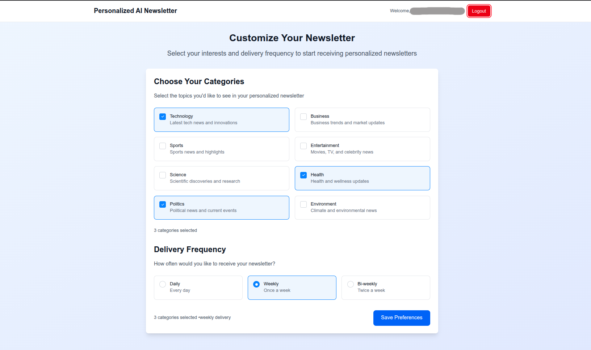

# AI Newsletter Generator

An intelligent newsletter platform that automatically fetches news articles, generates AI-powered summaries using LLMs, and delivers personalized newsletters to subscribers based on their preferences.


## Dashboard



## ✨ Features

### AI-Powered Content Generation
The system fetches recent news articles from selected categories and uses LLMs to create personalized summaries that are delivered via email.

### Scheduled Workflows
Inngest handles the scheduling and execution of newsletter generation, ensuring reliable delivery even if the system encounters temporary issues.

### User Preference Management
Users can select their preferred news categories, delivery frequency, and easily activate/deactivate their newsletter subscription.

### Real-time Dashboard
A dashboard shows current preferences, newsletter status, and provides easy management of all settings.

## 🛠 Tech Stack

- **Next.js 15** – React framework with App Router & server components
- **Supabase** – Hosted Postgres, authentication & real-time subscriptions
- **OpenAI or OpenRouter LLM models** – AI-powered newsletter content generation
- **Inngest** –  Handle background jobs for newsletter scheduling
- **TailwindCSS** – Utility-first styling
- **TypeScript** – Static typing and developer tooling
- **EmailJS** – Email delivery service
- **NewsAPI** – News article fetching

## 📋 Prerequisites

- Node.js (v18+)
- Supabase CLI
- Supabase project (URL & ANON key)
- OpenAI or OpenRouter API key
- Inngest account (signing key)
- NewsAPI key
- EmailJS account (service ID, template ID, public key)

## 🚀 Getting Started

### 1. Clone and Install Dependencies

```bash
git clone https://github.com/LorenzoDantoni/ai-newsletter.git
cd ai-newsletter
npm install
```

### 2. Environment Configuration

Create a `.env.local` file in the root directory and add your API credentials:

```env
# OpenAI or OpenRouter API Key for AI summarization
# OPENAI_API_KEY=your_openai_api_key_here
OPENROUTER_API_KEY=your_openrouter_api_key_here

# Inngest signing key for webhook verification
INGEST_SIGNING_KEY=your_inngest_signing_key_here

# News API key for fetching articles
NEWS_API_KEY=your_news_api_key_here

# EmailJS configuration for sending newsletters
EMAILJS_SERVICE_ID=your_emailjs_service_id_here
EMAILJS_TEMPLATE_ID=your_emailjs_template_id_here
EMAILJS_PUBLIC_KEY=your_emailjs_public_key_here
EMAILJS_PRIVATE_KEY=your_emailjs_private_key_here

# Supabase configuration
NEXT_PUBLIC_SUPABASE_URL=your_supabase_url
NEXT_PUBLIC_SUPABASE_ANON_KEY=your_supabase_anon_key

```

### 3. Database Setup

Run the following SQL statements in your Supabase SQL editor to set up the required database tables and policies:

```sql
CREATE TABLE user_preferences (
  id UUID DEFAULT gen_random_uuid() PRIMARY KEY,
  user_id UUID REFERENCES auth.users(id) ON DELETE CASCADE UNIQUE,
  categories TEXT NOT NULL,
  frequency TEXT NOT NULL CHECK (frequency IN ('daily', 'weekly', 'biweekly')),
  email TEXT NOT NULL,
  is_active BOOLEAN NOT NULL DEFAULT TRUE,
  created_at TIMESTAMP WITH TIME ZONE DEFAULT NOW(),
  updated_at TIMESTAMP WITH TIME ZONE DEFAULT NOW()
);

-- Enable RLS on the table
ALTER TABLE user_preferences ENABLE ROW LEVEL SECURITY;

-- Users can view their own preferences
CREATE POLICY "Users can view their own preferences"
ON user_preferences
FOR SELECT
TO authenticated
USING (user_id = (SELECT auth.uid()));

-- Users can insert their own preferences
CREATE POLICY "Users can insert their own preferences"
ON user_preferences
FOR INSERT
TO authenticated
WITH CHECK (user_id = (SELECT auth.uid()));

-- Users can update their own preferences
CREATE POLICY "Users can update their own preferences"
ON user_preferences
FOR UPDATE
TO authenticated
USING (user_id = (SELECT auth.uid()))
WITH CHECK (user_id = (SELECT auth.uid()));

-- Users can delete their own preferences
CREATE POLICY "Users can delete their own preferences"
ON user_preferences
FOR DELETE
TO authenticated
USING (user_id = (SELECT auth.uid()));
```

### 4. API Keys Setup

#### OpenAI API Key
1. Go to [OpenAI Platform](https://platform.openai.com)
2. Create a new API key
3. Add it to your `.env.local` file

#### News API Key
1. Go to [NewsAPI.org](https://newsapi.org)
2. Sign up for a free account
3. Get your API key
4. Add it to your `.env.local` file

#### Inngest Signing Key
1. Go to [Inngest Cloud](https://www.inngest.com)
2. Create a free account
3. Create a new app
4. Get your signing key
5. Add it to your `.env.local` file

### 5. Run the Application

Start both development servers in separate terminals:

```bash
# Terminal 1 - Next.js App
npm run dev

# Terminal 2 - Inngest Dev Server
npx inngest-cli@latest dev
```

The application will be available at `http://localhost:3000`.
